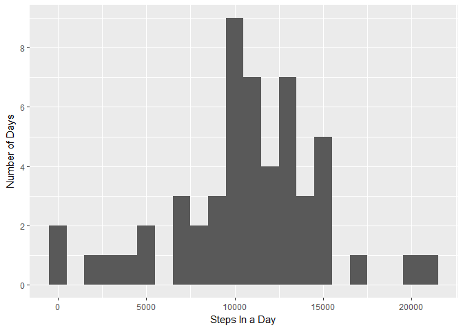
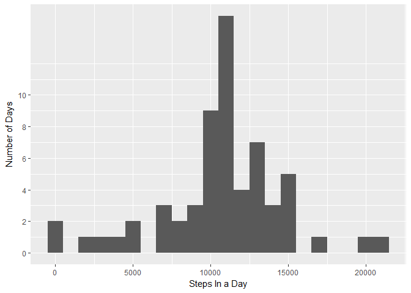
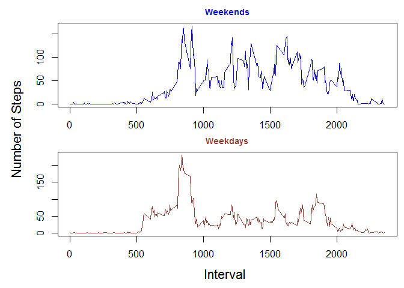

# Reproducible Research: Peer Assessment 1


## Loading and preprocessing the data
First we just need to load some packages that we'll be using, and read in the data.

```r
library(dplyr)
library(ggplot2)
activity <- read.csv("activity.csv")
```
  
  As you can see, the "date" data is actually a factor right now. We'll need it to be formatted as a date later.

```r
class(activity$date)
```

```
## [1] "factor"
```

```r
activity$date <- as.Date(activity$date, "%Y-%m-%d")
```

## What is mean total number of steps taken per day?
First we want to calculate the total number of steps taken each day. Let's just look at the head, to keep things tidy.

```r
day.totals <- activity %>% filter(!is.na(steps)) %>% group_by(date) %>% summarise(stepsByDay = sum(steps))
head(day.totals)
```

```
## # A tibble: 6 × 2
##         date stepsByDay
##       <date>      <int>
## 1 2012-10-02        126
## 2 2012-10-03      11352
## 3 2012-10-04      12116
## 4 2012-10-05      13294
## 5 2012-10-06      15420
## 6 2012-10-07      11015
```

Plotting this data will make it much easier to interpret. Here we create a histogram of the total number of steps taken each day.

```r
day.totals %>%
     ggplot(aes(x=stepsByDay)) + geom_histogram(binwidth = 1000) +
     scale_y_continuous(breaks=seq(0,10,2)) +
     labs(x="Steps In a Day", y="Number of Days")
```

<!-- -->
  
We can see that the distribution is roughly symmetric, centered around 11,000 steps in a day. There are some very high days, at or over 20,000 steps, and some very low days, at 0 steps. The 0's are suspicious and may indicate bad data, as it would be very rare for a healthy person to take 0 steps in a day.

Let's also take a look at the mean and median of steps per day.

```r
day.totals %>% 
     summarise(mean = mean(stepsByDay), med = median(stepsByDay))
```

```
## # A tibble: 1 × 2
##       mean   med
##      <dbl> <int>
## 1 10766.19 10765
```
These both correspond well with our histogram analysis.


## What is the average daily activity pattern?
Now let's examine some daily patterns. First we'll do a time series plot of the 5-minute intervals and the number of steps taken, averaged across all days.

```r
activity %>% filter(!is.na(steps)) %>% group_by(interval) %>%
     summarise(StByInt = mean(steps)) %>%
     ggplot(aes(x=interval, y=StByInt)) +
     geom_line() + labs(x="Interval", y="Average Number of Steps")
```

<!-- -->
  
And let's investigate the most active intervals, on average.

```r
head(intervals <- activity %>% filter(!is.na(steps)) %>%
          group_by(interval) %>%
          summarise(avgsteps = as.integer(round(mean(steps),0))) %>%
          arrange(-avgsteps))
```

```
## # A tibble: 6 × 2
##   interval avgsteps
##      <int>    <int>
## 1      835      206
## 2      840      196
## 3      850      183
## 4      845      180
## 5      830      177
## 6      820      171
```
We can see that the interval 835 contains the maximum of average steps, with 206. In fact, the top six intervals are all between 820 and 850. This also corresponds with the spike in our time series plot.


## Imputing missing values
Let's evaluate how complete our data is, and check for missing values.

```r
colSums(is.na(activity))
```

```
##    steps     date interval 
##     2304        0        0
```

So we have 2304 rows that are missing "steps" data. It'd be nice to have those filled in, and we can impute values based on the rest of our data. We'll use the average-by-interval data frame we made to create a new data frame, "actv.fill", that contains all the raw data, plus data of the average steps, "avgsteps", of each interval across all days. Then, if the "steps" column is NA, we fill in the data with the average for that interval, and finally just remove the "avgsteps" column, with no more use for it.

```r
actv.fill <- merge(activity, intervals, by="interval")
actv.fill$steps <- ifelse(is.na(actv.fill$steps),
                          actv.fill$avgsteps, actv.fill$steps)
actv.fill$avgsteps <- NULL
```
Let's create a new histogram and a new mean & median calculation, based on our filled-in data frame.

```r
actv.fill %>% group_by(date) %>% summarise(stepsByDay = sum(steps)) %>%
     ggplot(aes(x=stepsByDay)) + geom_histogram(binwidth = 1000) +
     scale_y_continuous(breaks=seq(0,10,2)) +
     labs(x="Steps In a Day", y="Number of Days")
```

<!-- -->

```r
actv.fill %>% group_by(date) %>%
     summarise(stepsByDay = sum(steps)) %>%
     summarise(mean = mean(stepsByDay), med = median(stepsByDay))
```

```
## # A tibble: 1 × 2
##       mean   med
##      <dbl> <int>
## 1 10765.64 10762
```
We can see that the histogram looks quite similar. In fact, there's only one bin that has changed at all - the bin containing the most frequently number of steps per day has spiked considerably. This makes sense, given that we filled in the missing data using averages across all other days, so the filled-in data will follow the average very closely. The mean and median have also hardly changed.

## Are there differences in activity patterns between weekdays and weekends?
To examine weekdays vs. weekends, we first need to identify which days are which. We create a new column "day" with the name of each day. Then we use an ifelse statement to assign days to Weekend or Weekday values, and wrap it all in an as.factor() function.

```r
actv.fill$day <- format(actv.fill$date, "%a")

actv.fill$daytype <- as.factor(
     ifelse(actv.fill$day %in% c("Sat","Sun"), "Weekend", "Weekday")
     )
```

Now let's compare the average steps taken in each time interval across each type of day. First we create a new data frame with summarized statistics grouping by day and interval. Then we plot each day type in a panel plot, with some helpful formatting, coloring, and labeling.

```r
bydaytype <- actv.fill %>% group_by(daytype, interval) %>%
     summarise(avgsteps = mean(steps))

par(mar=c(1.9, 1, 2, 0.6), mfrow=c(2,1), oma = c(2.6,4,0,0))
plot(bydaytype[bydaytype$daytype == "Weekend", ]$interval,
     bydaytype[bydaytype$daytype == "Weekend", ]$avgsteps,
     type = "l", col = "blue3", main= "Weekends", col.main="blue3",
     cex.main=.9, xlab="", ylab="")
plot(bydaytype[bydaytype$daytype == "Weekday", ]$interval,
     bydaytype[bydaytype$daytype == "Weekday", ]$avgsteps,
     type = "l", col= "coral4", main= "Weekdays", col.main = "coral4",
     cex.main=.9, xlab="", ylab="")
mtext(text="Interval",side=1,line=1,cex=1.4,outer=TRUE)
mtext(text="Number of Steps",side=2,line=2,cex=1.4,outer=TRUE)
```

<!-- -->
  
Not surprisingly, there is more activity on the weekends, most likely indicating that this person works a normal M-F workweek. There is an early spike even on weekdays however, perhaps a morning exercise routine? One may also think that the early activity is due to commuting to work, but one would expect to see a corresponding spike at the end of the work day, which we do not find.  
  
  
  
  
  
.  
